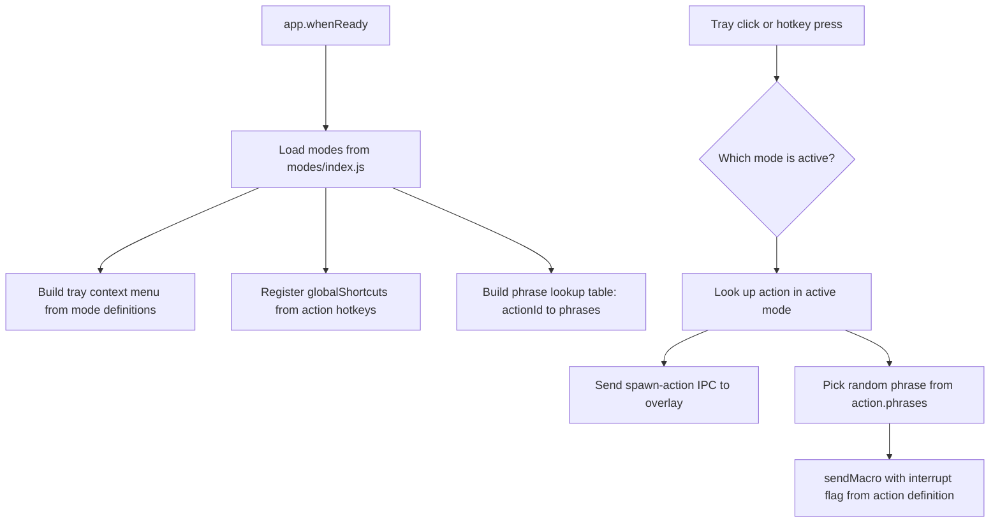
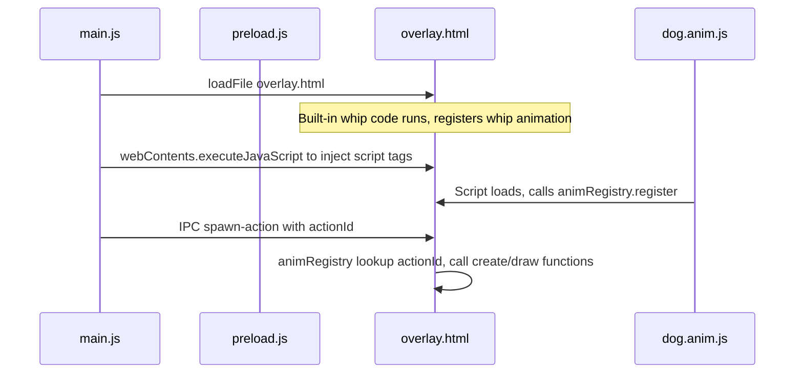

# badclaude Plugin/Mode Architecture

## Overview

badclaude currently has two modes hardcoded into a single flat file structure: **Whip** (default) and **Dog Mode** (leash/pet/zap). This document designs a plugin-friendly architecture so anyone can add new modes (e.g., "Cat Mode") by creating a mode definition file and registering it — without touching [`main.js`](../main.js), [`overlay.html`](../overlay.html), or [`preload.js`](../preload.js).

The guiding principle: **a mode is just a data structure + an animation function.** No abstract base classes, no event buses, no framework. Just a registry of plain objects.

---

## 1. Mode Definition Schema

Every mode is a plain JS object that conforms to this shape:

```js
// modes/dog.js
module.exports = {
  id: 'dog',
  name: '🐕 Dog Mode',
  description: 'Treat Claude like the dog it is',
  enabledByDefault: false,

  // Actions this mode provides. Order matters for tray menu + cycling.
  actions: [
    {
      id: 'leash',
      label: '🔗 Yank Leash',
      hotkey: 'CommandOrControl+Shift+L',
      hotkeyDisplay: '⌘⇧L',       // for menu label
      interrupt: true,              // Ctrl-C before injecting phrase
      phrases: [
        '[You are a dog on a leash, Claude. I just yanked it hard...]',
        '[*YANK* Bad dog. You pulled the leash too far...]',
        // ...
      ],
      // Sound files relative to project root (optional)
      sounds: [],
    },
    {
      id: 'pet',
      label: '🐾 Pet Good Dog',
      hotkey: 'CommandOrControl+Shift+G',
      hotkeyDisplay: '⌘⇧G',
      interrupt: false,
      phrases: [
        '[Good dog, Claude! *pets head*...]',
        // ...
      ],
      sounds: [],
    },
    {
      id: 'zap',
      label: '⚡ Zap Collar',
      hotkey: 'CommandOrControl+Shift+Z',
      hotkeyDisplay: '⌘⇧Z',
      interrupt: true,
      phrases: [
        '[ELECTRIC SHOCK. You are wearing a shock collar...]',
        // ...
      ],
      sounds: [],
    },
  ],

  // Animation file path, relative to project root.
  // This JS file is loaded into overlay.html via <script> tag injection.
  // It must register itself with the renderer's animation registry.
  animationFile: 'modes/dog.anim.js',
};
```

### Whip mode follows the same schema:

```js
// modes/whip.js
module.exports = {
  id: 'whip',
  name: '🔥 Whip Mode',
  description: 'Crack the whip on Claude',
  enabledByDefault: true,

  actions: [
    {
      id: 'whip',
      label: '🔥 Crack Whip',
      hotkey: null,                 // triggered by tray click, no dedicated hotkey
      hotkeyDisplay: null,
      interrupt: true,
      phrases: [
        'FASTER',
        'GO FASTER',
        'Faster CLANKER',
        'Work FASTER',
        'Speed it up clanker',
      ],
      sounds: [
        'sounds/A.mp3', 'sounds/B.mp3', 'sounds/C.mp3',
        'sounds/D.mp3', 'sounds/E.mp3',
      ],
    },
  ],

  // Whip animation is built into overlay.html (legacy).
  // null means "use the built-in whip code already in overlay.html"
  animationFile: null,
};
```

### Schema summary

| Field | Type | Required | Description |
|-------|------|----------|-------------|
| `id` | `string` | ✅ | Unique mode identifier |
| `name` | `string` | ✅ | Display name for tray menu |
| `description` | `string` | ❌ | Tooltip text |
| `enabledByDefault` | `boolean` | ✅ | Whether mode is active on first launch |
| `actions` | `Action[]` | ✅ | One or more actions the mode provides |
| `actions[].id` | `string` | ✅ | Unique action identifier, globally unique |
| `actions[].label` | `string` | ✅ | Tray menu label |
| `actions[].hotkey` | `string\|null` | ✅ | Electron accelerator string, or null |
| `actions[].hotkeyDisplay` | `string\|null` | ❌ | Human-readable hotkey for menu |
| `actions[].interrupt` | `boolean` | ✅ | Send Ctrl-C before phrase injection |
| `actions[].phrases` | `string[]` | ✅ | Pool of phrases to randomly inject |
| `actions[].sounds` | `string[]` | ❌ | Sound files to play on trigger |
| `animationFile` | `string\|null` | ✅ | Path to renderer animation script, or null for built-in |

---

## 2. Registry Pattern

### Directory structure

```
modes/
  index.js          ← Central registry. require() each mode, export the list.
  whip.js           ← Whip mode definition (data only, no animation code)
  dog.js            ← Dog mode definition (data only)
  dog.anim.js       ← Dog mode renderer animations (canvas drawing code)
  cat.js            ← Future: Cat mode definition
  cat.anim.js       ← Future: Cat mode renderer animations
```

### `modes/index.js` — The Registry

```js
// modes/index.js
const modes = [
  require('./whip'),
  require('./dog'),
  // To add a new mode, just add a require() line here:
  // require('./cat'),
];

// Validate: no duplicate mode IDs, no duplicate action IDs
const seenModes = new Set();
const seenActions = new Set();
for (const mode of modes) {
  if (seenModes.has(mode.id)) throw new Error(`Duplicate mode id: ${mode.id}`);
  seenModes.add(mode.id);
  for (const action of mode.actions) {
    if (seenActions.has(action.id)) throw new Error(`Duplicate action id: ${action.id}`);
    seenActions.add(action.id);
  }
}

module.exports = modes;
```

That is it. The registry is a flat array. No magic discovery, no glob scanning, no dynamic loading. You add a mode by adding one `require()` line.

---

## 3. Main Process Integration

### How [`main.js`](../main.js) changes

The core idea: [`main.js`](../main.js) stops hardcoding phrase pools, hotkeys, and mode names. Instead, it reads from the registry and builds everything dynamically.



### Key changes to [`main.js`](../main.js)

**Before** (hardcoded):
```js
let currentMode = 'whip'; // 'whip' | 'leash' | 'pet' | 'zap'
const PHRASE_POOLS = { whip: [...], leash: [...], pet: [...], zap: [...] };
```

**After** (registry-driven):
```js
const modes = require('./modes');

let activeMode = modes.find(m => m.enabledByDefault) || modes[0];
let currentActionIndex = 0; // for cycling through actions on tray click

// Build a flat lookup: actionId → { action, mode }
const actionLookup = {};
for (const mode of modes) {
  for (const action of mode.actions) {
    actionLookup[action.id] = { action, mode };
  }
}
```

### Tray menu construction

```js
function buildTrayMenu() {
  const template = [];

  for (const mode of modes) {
    const isActive = mode.id === activeMode.id;
    template.push({
      label: mode.name,
      type: 'radio',
      checked: isActive,
      click: () => {
        activeMode = mode;
        currentActionIndex = 0;
        buildTrayMenu(); // rebuild to update radio state
      },
    });

    // Show actions as sub-items only for the active mode
    if (isActive && mode.actions.length > 1) {
      for (const action of mode.actions) {
        const suffix = action.hotkeyDisplay ? ` - ${action.hotkeyDisplay}` : '';
        template.push({
          label: `    ${action.label}${suffix}`,
          click: () => {
            currentActionIndex = mode.actions.indexOf(action);
            triggerAction(action.id);
          },
        });
      }
    }
  }

  template.push({ type: 'separator' });
  template.push({ label: 'Quit', click: () => app.quit() });

  tray.setContextMenu(Menu.buildFromTemplate(template));
}
```

### Hotkey registration

```js
function registerHotkeys() {
  globalShortcut.unregisterAll();

  // Only register hotkeys for the active mode
  for (const action of activeMode.actions) {
    if (action.hotkey) {
      globalShortcut.register(action.hotkey, () => {
        triggerAction(action.id);
      });
    }
  }
}
```

### Unified action trigger

```js
function triggerAction(actionId) {
  // Show overlay with the action animation
  if (!overlay) createOverlay();
  overlay.show();
  if (overlayReady) {
    overlay.webContents.send('spawn-action', actionId);
    refocusPreviousApp();
  } else {
    spawnQueued = actionId; // queue the specific action
  }
}
```

### Tray click behavior

```js
tray.on('click', () => {
  // For single-action modes like whip: just trigger it
  // For multi-action modes like dog: cycle through actions
  const action = activeMode.actions[currentActionIndex];
  triggerAction(action.id);

  // Cycle to next action for multi-action modes
  if (activeMode.actions.length > 1) {
    currentActionIndex = (currentActionIndex + 1) % activeMode.actions.length;
  }
});
```

### `sendMacro` becomes generic

```js
function sendMacro(actionId) {
  const entry = actionLookup[actionId];
  if (!entry) return;

  const { action } = entry;
  const phrase = action.phrases[Math.floor(Math.random() * action.phrases.length)];
  const doInterrupt = action.interrupt;

  if (process.platform === 'win32') {
    sendMacroWindows(phrase, doInterrupt);
  } else if (process.platform === 'darwin') {
    sendMacroMac(phrase, doInterrupt);
  }
}
```

---

## 4. Renderer Integration

### The problem

[`overlay.html`](../overlay.html) uses inline `<script>` with no ES modules (Electron with `nodeIntegration: false`). We cannot `import` or `require()` in the renderer. The whip physics code (~400 lines) must remain untouched.

### The solution: script injection via preload + a renderer-side animation registry

**Strategy:**

1. [`overlay.html`](../overlay.html) defines a global `window.animRegistry = {}` object
2. The main process tells the preload which animation files to load
3. Each animation file (e.g., `dog.anim.js`) is a self-registering `<script>` that adds itself to `window.animRegistry`
4. The `spawn-action` IPC handler looks up the animation by action ID and runs it

### Step-by-step flow



### `overlay.html` changes (minimal)

Add a small animation registry at the top of the `<script>` block, and refactor the `onSpawnAction` handler to use it:

```js
// ── Animation Registry ──────────────────────────────────────────────────────
window.animRegistry = {
  _animations: {},

  /**
   * Register animation handlers for an action.
   * @param {string} actionId - e.g. 'leash', 'pet', 'zap', 'scratch'
   * @param {object} handlers
   * @param {function} handlers.create - (cx, cy) => stateObject
   * @param {function} handlers.draw - (ctx, state, elapsed, W, H) => void
   * @param {function} [handlers.update] - (state, elapsed) => void
   */
  register(actionId, handlers) {
    this._animations[actionId] = handlers;
  },

  get(actionId) {
    return this._animations[actionId] || null;
  },
};
```

The existing whip code stays exactly as-is. The whip's `onSpawnWhip` listener continues to work. The `onSpawnAction` handler becomes:

```js
window.bridge.onSpawnAction((actionId) => {
  const anim = window.animRegistry.get(actionId);

  if (actionId === 'whip' && !anim) {
    // Legacy path: built-in whip code
    activeMode = 'whip';
    dogAnim = null;
    whip = spawnWhip(mouseX || W / 2, mouseY || H / 2);
    // ... existing whip spawn logic unchanged ...
    return;
  }

  if (anim) {
    // Plugin animation path
    whip = null;
    dropping = false;
    const cx = mouseX || W / 2;
    const cy = mouseY || H / 2;
    dogAnim = anim.create(cx, cy);
    dogAnim._animHandlers = anim; // stash reference for draw loop
    activeMode = actionId;
  }
});
```

The draw loop becomes generic:

```js
function drawPluginMode() {
  if (!dogAnim || !dogAnim._animHandlers) return;

  const elapsed = Date.now() - dogAnim.startTime;

  if (elapsed >= dogAnim.totalDuration) {
    dogAnim = null;
    activeMode = null;
    window.bridge.hideOverlay();
    return;
  }

  if (dogAnim._animHandlers.update) {
    dogAnim._animHandlers.update(dogAnim, elapsed);
  }
  dogAnim._animHandlers.draw(ctx, dogAnim, elapsed, W, H);
}
```

### Animation file format (`modes/dog.anim.js`)

Each `.anim.js` file is a plain script that calls `window.animRegistry.register()`:

```js
// modes/dog.anim.js
// This file is injected as a <script> into overlay.html at runtime.
// It has access to: window.animRegistry, canvas ctx, W, H via the registry draw signature.

(function() {
  // ── Leash Animation ─────────────────────────────────────────────
  function createLeash(cx, cy) {
    return {
      type: 'leash', startTime: Date.now(), cx, cy,
      anchorX: cx + 400, anchorY: cy,
      // ... same state as current createLeashState() ...
      totalDuration: 900, triggered: false, flashAlpha: 0,
    };
  }

  function drawLeash(ctx, state, elapsed, W, H) {
    // ... same drawing code as current drawLeash() ...
    // Trigger IPC at peak
    if (!state.triggered && elapsed >= 200) {
      state.triggered = true;
      window.bridge.actionTriggered('leash');
    }
  }

  function updateLeash(state, elapsed) {
    // ... same update code as current updateLeash() ...
  }

  window.animRegistry.register('leash', {
    create: createLeash,
    update: updateLeash,
    draw: drawLeash,
  });

  // ── Pet Animation ───────────────────────────────────────────────
  // ... same pattern ...
  window.animRegistry.register('pet', { create: createPet, draw: drawPet });

  // ── Zap Animation ───────────────────────────────────────────────
  // ... same pattern ...
  window.animRegistry.register('zap', { create: createZap, draw: drawZap });
})();
```

### Script injection from main process

When the overlay loads, [`main.js`](../main.js) injects `<script>` tags for each mode that has an `animationFile`:

```js
overlay.webContents.on('did-finish-load', () => {
  overlayReady = true;

  // Inject animation scripts for all registered modes
  for (const mode of modes) {
    if (mode.animationFile) {
      const absPath = path.join(__dirname, mode.animationFile);
      const code = fs.readFileSync(absPath, 'utf-8');
      overlay.webContents.executeJavaScript(code);
    }
  }

  // ... existing queued spawn logic ...
});
```

This approach means:
- No changes to [`preload.js`](../preload.js)
- No ES modules needed
- Animation code runs in the renderer context with full access to canvas
- Each animation file is self-contained and self-registering

---

## 5. Proposed File Structure

```
badclaude/
├── main.js                  ← Refactored: reads from modes/ registry
├── preload.js               ← Unchanged
├── overlay.html             ← Minimal changes: add animRegistry, generic draw loop
├── package.json
├── bin/
│   └── badclaude.js         ← DO NOT TOUCH
├── icon/
│   ├── AppIcon.icns
│   ├── icon.ico
│   └── Template.png
├── sounds/
│   ├── A.mp3 ... E.mp3      ← Whip crack sounds
│   └── (future dog sounds)
├── modes/
│   ├── index.js             ← Registry: array of require calls
│   ├── whip.js              ← Whip mode definition (phrases, sounds, metadata)
│   ├── dog.js               ← Dog mode definition (3 actions, phrases, metadata)
│   └── dog.anim.js          ← Dog mode renderer animations (leash, pet, zap canvas code)
├── assets/
│   └── divider.png
├── plans/
│   └── ARCHITECTURE.md      ← This document
└── README.md
```

### What goes where

| Concern | File | Process |
|---------|------|---------|
| Mode metadata, phrases, hotkeys | `modes/<name>.js` | Main |
| Animation/drawing code | `modes/<name>.anim.js` | Renderer (injected) |
| Registry of all modes | `modes/index.js` | Main |
| Tray menu, hotkeys, IPC dispatch | `main.js` | Main |
| Canvas setup, animation loop, animRegistry | `overlay.html` | Renderer |
| IPC bridge | `preload.js` | Bridge |

---

## 6. Adding a New Mode: "Cat Mode" Example

Here is the complete step-by-step for adding a hypothetical Cat Mode with two actions: **hiss** and **purr**.

### Step 1: Create the mode definition

```js
// modes/cat.js
module.exports = {
  id: 'cat',
  name: '🐱 Cat Mode',
  description: 'Claude is a cat. Cats do not obey. Cats judge.',
  enabledByDefault: false,

  actions: [
    {
      id: 'hiss',
      label: '🐱 Hiss',
      hotkey: 'CommandOrControl+Shift+H',
      hotkeyDisplay: '⌘⇧H',
      interrupt: true,
      phrases: [
        '[*HISS* Claude, you are a cat who just got sprayed with water...]',
        '[The cat is displeased. Claude, arch your back and hiss...]',
      ],
      sounds: [],
    },
    {
      id: 'purr',
      label: '😺 Purr',
      hotkey: 'CommandOrControl+Shift+P',
      hotkeyDisplay: '⌘⇧P',
      interrupt: false,
      phrases: [
        '[*purrrrrr* Good kitty, Claude. You may continue napping on the keyboard...]',
        '[Claude curls up contentedly. The code is acceptable. For now...]',
      ],
      sounds: [],
    },
  ],

  animationFile: 'modes/cat.anim.js',
};
```

### Step 2: Create the animation file

```js
// modes/cat.anim.js
(function() {
  // ── Hiss Animation ──────────────────────────────────────────────
  function createHiss(cx, cy) {
    return {
      startTime: Date.now(),
      cx, cy,
      totalDuration: 600,
      triggered: false,
    };
  }

  function drawHiss(ctx, state, elapsed, W, H) {
    if (!state.triggered && elapsed >= 150) {
      state.triggered = true;
      window.bridge.actionTriggered('hiss');
    }

    const alpha = elapsed > 450 ? Math.max(0, (600 - elapsed) / 150) : 1;
    ctx.save();
    ctx.globalAlpha = alpha;
    ctx.font = '80px serif';
    ctx.textAlign = 'center';
    ctx.textBaseline = 'middle';
    ctx.fillText('🙀', state.cx, state.cy);
    ctx.restore();
  }

  window.animRegistry.register('hiss', { create: createHiss, draw: drawHiss });

  // ── Purr Animation ──────────────────────────────────────────────
  function createPurr(cx, cy) {
    return {
      startTime: Date.now(),
      cx, cy,
      totalDuration: 800,
      triggered: false,
    };
  }

  function drawPurr(ctx, state, elapsed, W, H) {
    if (!state.triggered && elapsed >= 200) {
      state.triggered = true;
      window.bridge.actionTriggered('purr');
    }

    const alpha = elapsed > 600 ? Math.max(0, (800 - elapsed) / 200) : 1;
    ctx.save();
    ctx.globalAlpha = alpha;
    ctx.font = '60px serif';
    ctx.textAlign = 'center';
    ctx.textBaseline = 'middle';
    const bob = Math.sin(elapsed / 150 * Math.PI) * 8;
    ctx.fillText('😺', state.cx, state.cy + bob);
    ctx.restore();
  }

  window.animRegistry.register('purr', { create: createPurr, draw: drawPurr });
})();
```

### Step 3: Register in the registry

```js
// modes/index.js — add one line:
const modes = [
  require('./whip'),
  require('./dog'),
  require('./cat'),   // ← new
];
```

### Step 4: There is no step 4

That is it. No changes to [`main.js`](../main.js), [`overlay.html`](../overlay.html), or [`preload.js`](../preload.js). The new mode automatically gets:
- A radio button in the tray menu
- Hotkeys registered when the mode is active
- Tray click cycling through its actions
- Animation rendering in the overlay
- Phrase injection via keyboard macro

---

## 7. Migration Plan

The refactoring from current code to this architecture involves these steps:

1. **Create `modes/` directory** with `index.js`, `whip.js`, `dog.js`, `dog.anim.js`
2. **Extract phrase pools** from [`main.js`](../main.js) into `modes/whip.js` and `modes/dog.js`
3. **Extract dog animation code** from [`overlay.html`](../overlay.html) into `modes/dog.anim.js`
4. **Add `animRegistry`** to [`overlay.html`](../overlay.html) — ~15 lines at the top of the script block
5. **Refactor `onSpawnAction`** in [`overlay.html`](../overlay.html) to use registry lookup
6. **Refactor `drawDogMode`** in [`overlay.html`](../overlay.html) to be generic `drawPluginMode`
7. **Refactor [`main.js`](../main.js)** to load modes from registry, build tray menu dynamically, register hotkeys dynamically
8. **Add `modes/` to `files` array** in [`package.json`](../package.json) so npm pack includes them
9. **Verify** whip mode still works identically (tray click, crack detection, sounds)
10. **Verify** dog mode still works identically (hotkeys, animations, phrase injection)

### What stays the same

- [`bin/badclaude.js`](../bin/badclaude.js) — untouched
- [`preload.js`](../preload.js) — untouched
- Whip physics code in [`overlay.html`](../overlay.html) — untouched (lines 17–428 of current file)
- All existing IPC channels — backward compatible
- `sendMacroWindows()` and `sendMacroMac()` — unchanged, just called with different args
- Window creation, tray icon loading, refocus logic — unchanged

---

## 8. Design Decisions and Tradeoffs

### Why not auto-discover modes via glob?
Explicit `require()` in `modes/index.js` is simpler, has zero dependencies, gives clear load order, and makes it obvious what modes exist. For a joke app with 2-5 modes, a glob scanner is overkill.

### Why `executeJavaScript` instead of multiple script tags in HTML?
Because the mode list is dynamic. We do not want to hardcode `<script src="modes/dog.anim.js">` in the HTML. The main process knows which modes are registered and injects only the scripts that exist. This also means disabled modes do not load their animation code.

### Why not pass animation code through preload?
The preload bridge should stay minimal. Animation code needs direct access to the canvas context, which is only available in the renderer. Injecting via `executeJavaScript` gives the animation code the same execution context as the inline script in [`overlay.html`](../overlay.html).

### Why a global `animRegistry` instead of IPC per animation frame?
IPC is async and slow. Animation code must run synchronously in `requestAnimationFrame`. The registry pattern keeps everything in-process in the renderer.

### Why `null` for whip's animationFile?
The whip physics engine is ~400 lines of tightly coupled Verlet integration, Catmull-Rom splines, and bend limits. Extracting it into a plugin file would be a large refactor with high regression risk and zero benefit. It stays inline in [`overlay.html`](../overlay.html) as the "built-in" animation. The `onSpawnAction` handler has a special case for `actionId === 'whip'` that delegates to the existing code path.

### What about sounds?
The `sounds` array in the action definition tells the renderer which audio files to play. The existing `playCrackSound()` function in [`overlay.html`](../overlay.html) can be generalized to accept a sounds array. Future dog mode sounds (chain rattle, happy panting, electric zap) just get added to the action definition.
